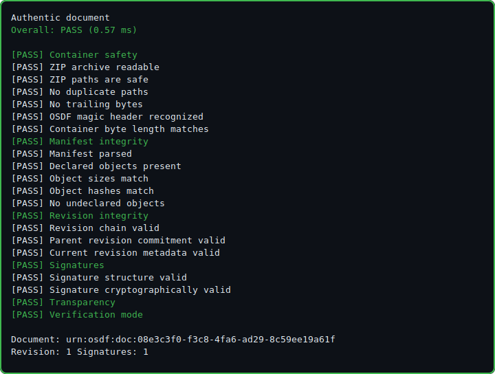
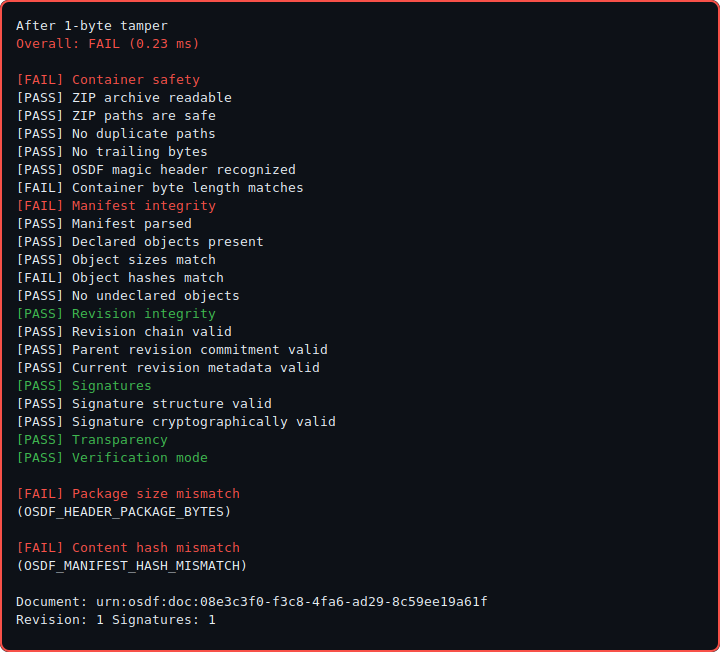

# OSDF

**Open Secure Document Format** · Cryptographic document packages with local, fail-closed verification.

[](LICENSE-APACHE)
[](https://www.rust-lang.org/)
[](CHANGELOG.md)

[OSDF Systems](https://github.com/osdf-systems) · [Repository](https://github.com/osdf-systems/osdf)

---

## Overview

OSDF is a **data-centric document format**: every byte in a package is declared, hashed, and signed. Verification runs **locally** in a memory-safe Rust core (CLI, library, or WASM) with explicit pass/fail reporting and no dependency on a remote service for integrity checks.

This repository is the **open core**: container format, verifier, transparency-log proofs, browser UI, and a gateway proof-of-concept. Enterprise identity, policy enforcement, and hosted ledger services are built in separate products.

| Property | Behavior |
| --- | --- |
| **Integrity** | SHA-256 per object, Merkle root, Ed25519 signatures, revision chain |
| **Parser safety** | Fail-closed ZIP walk; rejects traversal, undeclared objects, trailing bytes |
| **Offline use** | Embedded proofs and optional registry snapshots; live checks reported explicitly |
| **Transparency** | CT-style append-only ledger with inclusion proofs (Phase D) |

<p align="center">
  
  <br />
  <sub>Cryptographic chain-of-custody on a valid package</sub>
</p>

<p align="center">
  
  <br />
  <sub>Single-byte tamper detected in sub-millisecond verify paths (hardware-dependent)</sub>
</p>

---

## Quick start

**Requirements:** Rust 1.93+ ([rustup](https://rustup.rs/))

```bash
git clone https://github.com/osdf-systems/osdf.git
cd osdf
cargo build --release -p osdf-cli
```

**Verify a fixture package:**

```bash
# Windows
.\target\release\osdf.exe verify fixtures\valid\valid-committed.osdf

# Linux / macOS
./target/release/osdf verify fixtures/valid/valid-committed.osdf
```

**Run the safety demo** (timings from your machine):

```bash
cargo run --release -p osdf-cli -- demo safety
```

**Install to PATH** (optional):

```bash
cargo install --path crates/osdf-cli --locked
osdf verify fixtures/valid/valid-committed.osdf
osdf version
```

On Windows, `.\scripts\install-cli.ps1` installs to `%LOCALAPPDATA%\Programs\osdf\bin` and updates PATH. Release builds can auto-refresh that binary (see `.cargo/config.toml`).

Releases: stable tags, prereleases, and nightly CI artifacts. See [CHANGELOG.md](CHANGELOG.md).

---

## Components

| Crate / path | Role |
| --- | --- |
| [`crates/osdf-core`](crates/osdf-core) | Parser, builder, Merkle manifest, signatures, ledger proofs |
| [`crates/osdf-cli`](crates/osdf-cli) | Command-line tool (`verify`, `create`, `ledger`, `demo`) |
| [`crates/osdf-wasm`](crates/osdf-wasm) | Read-only WASM bindings for browser verification |
| [`web/`](web/) | Static drag-and-drop verifier (local-only, no upload) |
| [`gateway/`](gateway/) | Transparent Gateway PoC (MFA gate + structured document render) |
| [`fixtures/`](fixtures/) | Valid and adversarial test packages |
| [`specs/`](specs/) | Phase specifications and demonstration plan |

---

## Browser verifier

The WASM verifier uses the same Rust library as the CLI. Files never leave the browser.

```bash
rustup target add wasm32-unknown-unknown
cargo install wasm-pack
./scripts/build-wasm.sh    # or .\scripts\build-wasm.ps1 on Windows
./scripts/serve-web.sh       # or .\scripts\serve-web.ps1
```

Open `http://localhost:8080/`. Details: [docs/web-verifier.md](docs/web-verifier.md).

**Current scope:** structural and cryptographic verification. Organizational credentials, revocation, timestamps, and authoring are out of scope for this alpha. Supply a ledger trust file for transparency proof checks (CLI `--ledger-config` or browser textarea).

---

## Transparent Gateway (PoC)

Local MFA gate, verify, then render `content/document.json` as a readable form (tax demo fixtures).

```bash
./scripts/build-wasm.sh && ./scripts/serve-demo.sh
# Windows: .\scripts\build-wasm.ps1; .\scripts\serve-demo.ps1
```

Open `http://localhost:8081/gateway/` · demo MFA code: `847291`

| Fixture | Rev | Description |
| --- | ---: | --- |
| `fixtures/valid/taxes-template.osdf` | 1 | Blank simplified tax form |
| `fixtures/valid/Taxes.osdf` | 2 | Demo-filled submission |

Specification: [specs/phase-c-gateway.md](specs/phase-c-gateway.md)

---

## CLI examples

```bash
# Create and sign
osdf create output/signed.osdf --title "Signed" --commit
osdf verify output/signed.osdf
osdf inspect output/signed.osdf --json

# New revision
osdf commit-revision output/signed.osdf --output output/signed-rev2.osdf

# Transparency ledger
osdf ledger init --store ledger.json --key ledger-key.json
osdf ledger append --store ledger.json --package output/signed.osdf
osdf ledger attach-proof --store ledger.json --key ledger-key.json \
  --package output/signed.osdf --output output/with-proof.osdf --trust-config trust.json
osdf verify output/with-proof.osdf --ledger-config trust.json
```

`ledger-key.json` and `ledger.json` are gitignored; generate locally. Do not commit operator keys.

Regenerate committed fixtures:

```bash
cargo test -p osdf-core --test generate_fixtures write_fixtures -- --ignored
```

Regenerate README demo images after verifier output changes:

```bash
osdf demo safety --write-readme-assets docs/assets
```

---

## Roadmap

| Phase | Status | Deliverable |
| --- | --- | --- |
| **A** | Complete | Core format, CLI, adversarial fixtures |
| **B** | Complete | WASM verifier and static web UI |
| **C** | PoC | Transparent Gateway and tax demo |
| **D (M1)** | Complete | Transparency log proofs in verifier |
| **B.3** | In progress | Latest-revision registry; freshness/revocation next |
| **Demo package** | Active | Scripted end-to-end gateway demo ([plan](specs/demo-package.md)) |

**Profile note:** This build implements **OSDF-Core** with inline payload mode. Encrypted packages, hosted ledger services, and editors are planned for later phases.

---

## Development

```bash
cargo build --release
cargo test --workspace
```

Contributing: [CONTRIBUTING.md](CONTRIBUTING.md) · Security: [SECURITY.md](SECURITY.md)

Implementer specifications live in [`specs/`](specs/). Marketing and HTML documentation sites are maintained outside this repository.

---

## License

Dual-licensed under [Apache-2.0](LICENSE-APACHE) and [MIT](LICENSE-MIT).
