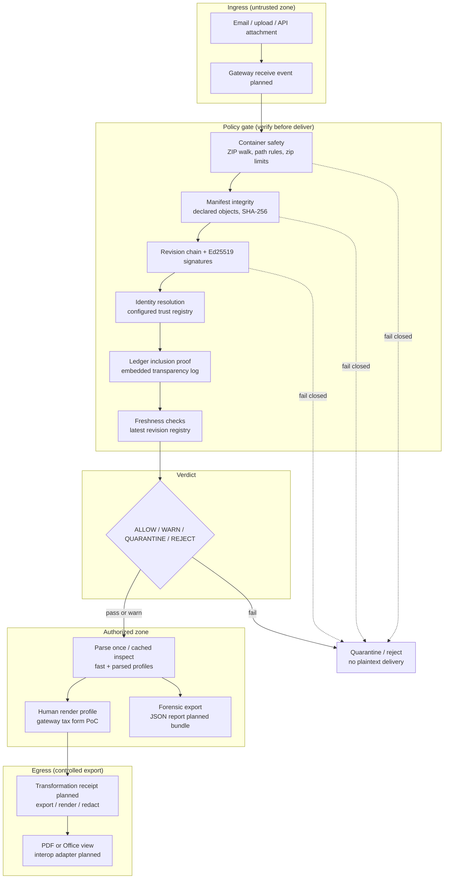
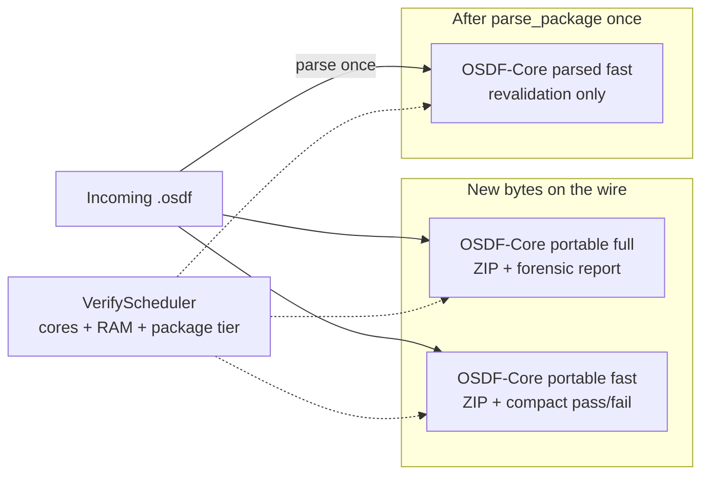

# Architecture

**Status:** Public alpha reference model. Diagram reflects shipped verifier and gateway PoC behavior; planned layers are marked.

OSDF treats **trust as a pipeline**, not a single signature check. Data moves through explicit layers; each layer can pass, warn, or fail closed before the next step runs.

---

## Zero Trust document flow

---

## Verification layering (permanent)

The verifier **always separates** these guarantees. A passing offline result is not the same as “latest revision” or “issuer is who you think.”

| Layer | Question answered | Alpha status |
| --- | --- | --- |
| 1. Container safety | Is the archive structurally safe to parse? | Shipped |
| 2. Manifest integrity | Does every byte match declared digests? | Shipped |
| 3. Signatures | Is the revision chain cryptographically signed? | Shipped |
| 4. Organizational identity | Does the key map to configured trust? | Shipped (local registry) |
| 5. Ledger inclusion | Was this revision logged in a trusted append-only log? | Shipped (embedded proof) |
| 6. Freshness | Is this the newest known revision? | Partial (file registry; live optional) |
| 7. Revocation | Were keys valid at signing time? | Planned |

Details: [specs/phase-b3.md](../specs/phase-b3.md)

---

## Profile placement in the pipeline

Benchmark each profile separately: [benchmarks.md](benchmarks.md)

---

## Component map

| Component | Role in the model |
| --- | --- |
| `osdf-core` | Layers 1-5 (+ partial 6) in Rust |
| `osdf-cli` / WASM | Same core, CLI or browser |
| `gateway/` | MFA + render after verify (PoC) |
| `VerifyPlan` / `scale_bench` | Thread and profile selection for throughput |
| Transformation receipt (draft) | Signed ingress/export provenance |
| Offline bundle (draft) | Point-in-time audit export |

Roadmap: [roadmap.md](roadmap.md)
