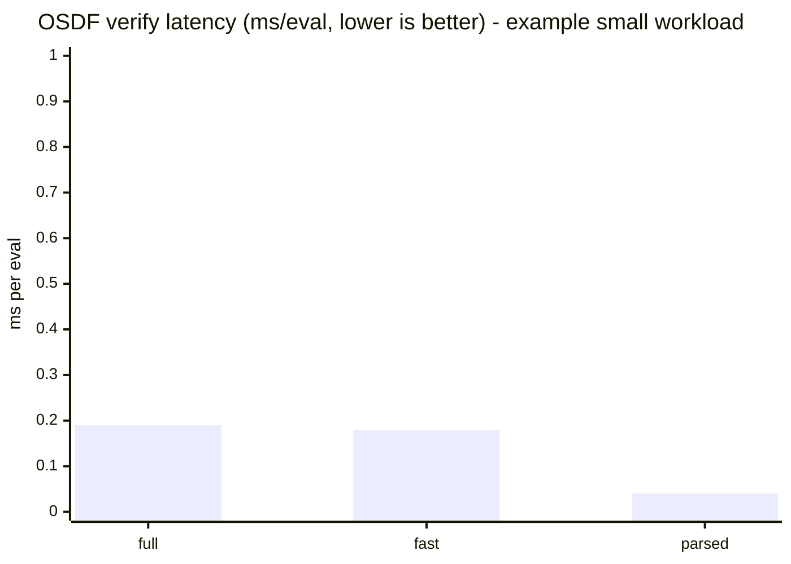
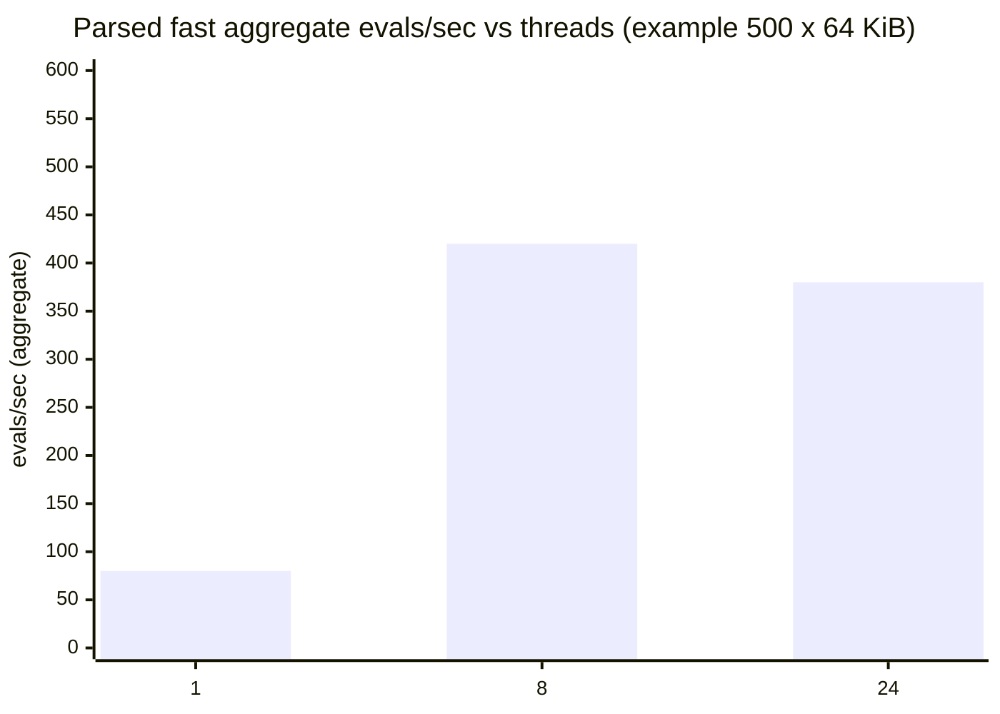
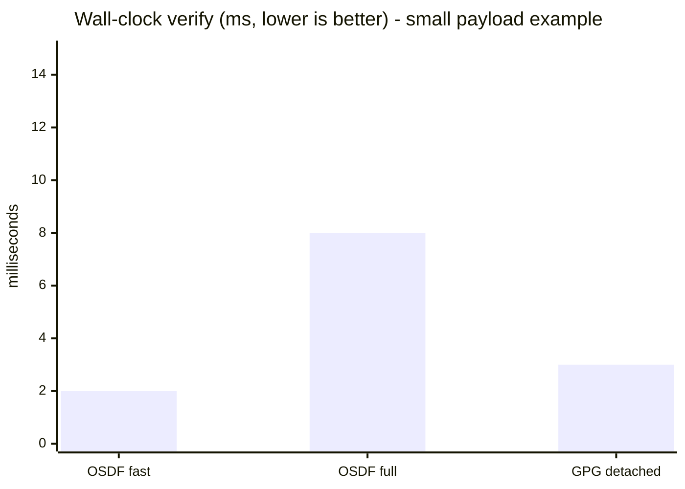

# Benchmarks

**Status:** Reproducible local benchmarks. Numbers are **machine-specific**; regenerate on your hardware before publishing.

OSDF exposes three verification profiles. **Do not mix throughput labels** across profiles or compare them to unrelated tools without reading [Comparison scope](#comparison-scope) below.

---

## Quick commands

### Criterion (Rust microbenchmarks)

Generates HTML reports under `target/criterion/`.

```bash
cargo test -p osdf-core --test generate_fixtures write_fixtures -- --ignored   # if fixtures missing
cargo bench -p osdf-core --bench verify_throughput
```

Profiles measured:

| Criterion group | What it measures |
| --- | --- |
| `verify_profile/full_report` | Portable full forensic verify |
| `verify_profile/portable_fast` | Portable fast verify |
| `verify_profile/parsed_fast` | Parsed-container revalidation |
| `parsed_parallel/threads/N` | Aggregate parsed revalidation across N threads |

### scale_bench (end-to-end throughput)

```bash
cargo run --release -p osdf-core --example scale_bench -- \
  --profile full --objects 10 --bytes 1024 --threads 1 --seconds 10

cargo run --release -p osdf-core --example scale_bench -- \
  --auto --objects 500 --bytes 65536 --seconds 10
```

Adaptive scheduling: `--auto` or `--auto-threads` (see [architecture.md](architecture.md)).

### Hyperfine (CLI wall-clock)

Requires [Hyperfine](https://github.com/sharkdp/hyperfine) and optional GnuPG for PGP comparison.

```bash
# macOS / Linux
./scripts/run-benchmarks.sh

# Windows
.\scripts\run-benchmarks.ps1
```

Outputs:

- `docs/assets/benchmarks/hyperfine-summary.md` (committed after you run locally)
- `docs/assets/benchmarks/hyperfine-results.json` (gitignored)

---

## Example results (illustrative)

Replace this section after running `./scripts/run-benchmarks.sh` on your machine. The chart uses **representative alpha measurements** on a dual-channel DDR5 workstation; your results will differ.

### OSDF profiles (same package, different paths)



| Profile | Objects x bytes | Threads | ~evals/sec | ~ms/eval | Notes |
| --- | --- | ---: | ---: | ---: | --- |
| full | 10 x 1 KiB | 1 | 5,260 | 0.19 | Forensic report |
| fast | 10 x 1 KiB | 1 | 5,500 | 0.18 | Compact pass/fail |
| parsed | 10 x 1 KiB | 1 | 25,000 | 0.04 | After `parse_package` once |
| full | 500 x 64 KiB | 1 | 80 | 12.5 | Large manifest scan |
| full | 500 x 64 KiB | 8 | 640 agg. | 12.5 per thread | Not linear speedup |

Run `scale_bench` with `--profile full|fast|parsed` to refresh these numbers.

### Parallel efficiency (parsed profile)



Oversubscribing threads (24 on memory-heavy packages) can **reduce** throughput. Use `VerifyPlan` / `--auto` to cap workers.

---

## Comparison scope

Comparisons to PGP and OpenTDF are **trust-model benchmarks**, not byte-for-byte equivalence.

| Tool | Typical operation | What is measured | What is *not* measured |
| --- | --- | --- | --- |
| **OSDF** | `osdf verify package.osdf` | Full container + manifest + chain + optional ledger | PDF rendering, policy decrypt |
| **PGP / GPG** | `gpg --verify` detached signature | Signature over a single payload file | Manifest object model, transparency log, revision chain |
| **OpenTDF** | TDF decrypt / policy unwrap | Attribute + policy gate for encrypted payload | Declarative manifest audit of every object (different design center) |

### OSDF vs PGP (GnuPG)

Hyperfine script compares:

1. **OSDF full verify** on `fixtures/valid/valid-committed.osdf`
2. **GPG detached verify** on a locally generated `benchmarks/payload.bin` + `.sig`

PGP proves a signature over one file. OSDF proves structure, every declared object, revision history, and optional log inclusion. **OSDF full verify does strictly more work**; fast profile is closer to a single-decision gate.

Expected shape (not a guarantee):



Install GnuPG to include the PGP bar in `./scripts/run-benchmarks.sh`.

### OSDF vs OpenTDF

OpenTDF (Virtru TDF) optimizes **encrypt-then-policy** delivery. OSDF optimizes **declare-then-hash-then-sign** auditability. A fair benchmark pairs:

| Scenario | OSDF | OpenTDF |
| --- | --- | --- |
| Integrity gate on ingest | `verify_package_bytes_fast` | Policy + unwrap latency (SDK) |
| Archive-grade audit | Full verify + offline bundle (planned) | Attribute inspection + audit log (product-specific) |
| Human view | Gateway render profile | Client decrypt view |

When OpenTDF tooling is installed, extend `scripts/run-benchmarks.sh` with your local TDF fixture.

### Obtain OpenTDF sample files

OpenTDF does **not** publish a static “download any TDF” URL for production files. TDFs are normally created against a platform instance. For benchmarks, use **official golden vectors**:

| File | How to get it |
| --- | --- |
| `fixtures/benchmarks/opentdf/small-java-4.3.0-e0f8caf.tdf` | Committed (~7 KiB) from [opentdf/tests golden](https://github.com/opentdf/tests/tree/main/xtest/golden) |
| `fixtures/benchmarks/opentdf/spec-nosign.ntdf` | Committed NanoTDF spec test vector |
| `big-java-4.3.0-e0f8caf.tdf` (~10 MiB) | `.\scripts\fetch-opentdf-fixtures.ps1` or `./scripts/fetch-opentdf-fixtures.sh` |

```powershell
.\scripts\fetch-opentdf-fixtures.ps1
```

Golden ZIP TDFs contain `0.manifest.json` + encrypted `0.payload`. **Decrypt benchmarks** need a running [OpenTDF platform](https://github.com/opentdf/platform) and `otdfctl`. Structural comparisons (read manifest from ZIP) work offline.

To generate **your own** TDF: follow [OpenTDF quickstart](https://opentdf.io/sdks/quickstart) with `otdfctl encrypt` or an SDK `createTDF` after platform provisioning.

---

## Reproducibility checklist

1. `cargo build --release -p osdf-cli`
2. Regenerate fixtures if missing (see Quick commands)
3. Record CPU model, RAM config, and OS in the markdown summary
4. Run Criterion + Hyperfine scripts
5. Commit updated `docs/assets/benchmarks/hyperfine-summary.md` if you want pinned numbers in docs (optional)

---

## CI note

Pull request CI runs correctness tests, not performance gates. Benchmark regressions are tracked locally or in a dedicated workflow later.

See also: [SECURITY.md](../SECURITY.md) (timing vs throughput), [architecture.md](architecture.md) (where each profile sits in the Zero Trust pipeline).
