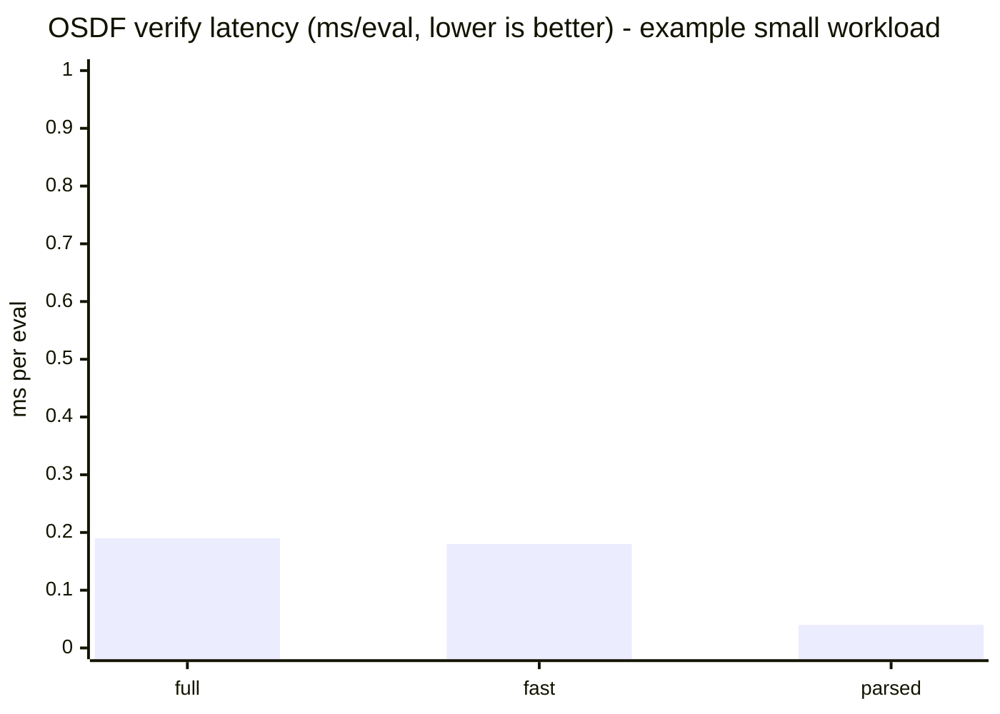
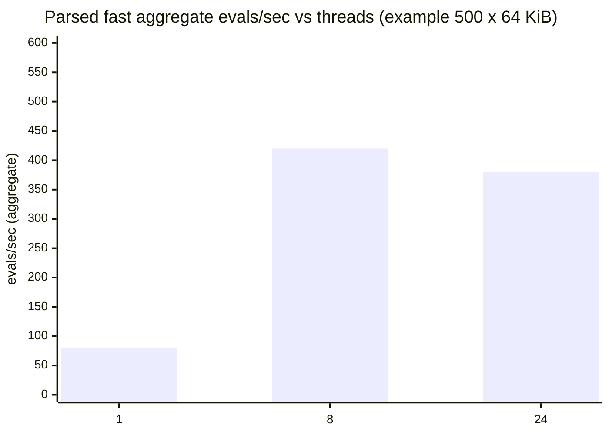
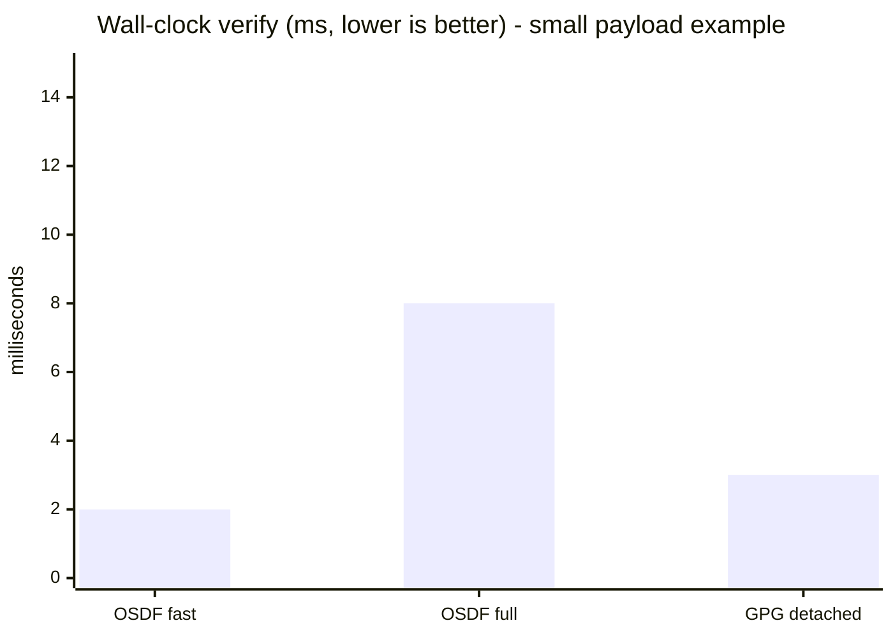

# Benchmarks

**Status:** Reproducible local benchmarks. Numbers are **machine-specific**; regenerate on your hardware before publishing.

OSDF exposes three verification profiles. **Do not mix throughput labels** across profiles or compare them to unrelated tools without reading [Comparison scope](#comparison-scope) below.

---

## Quick commands

### Criterion (Rust microbenchmarks)

Generates HTML reports under `target/criterion/`.

```bash
cargo test -p osdf-core --test generate_fixtures write_fixtures -- --ignored   # if fixtures missing
cargo bench -p osdf-core --bench verify_throughput
```

Profiles measured:

| Criterion group | What it measures |
| --- | --- |
| `verify_profile/full_report` | Portable full forensic verify |
| `verify_profile/portable_fast` | Portable fast verify |
| `verify_profile/parsed_fast` | Parsed-container revalidation |
| `parsed_parallel/threads/N` | Aggregate parsed revalidation across N threads |

### scale_bench (end-to-end throughput)

```bash
cargo run --release -p osdf-core --example scale_bench -- \
  --profile full --objects 10 --bytes 1024 --threads 1 --seconds 10

cargo run --release -p osdf-core --example scale_bench -- \
  --auto --objects 500 --bytes 65536 --seconds 10
```

Adaptive scheduling: `--auto` or `--auto-threads` (see [architecture.md](architecture.md)).

### Hyperfine (CLI wall-clock)

Requires [Hyperfine](https://github.com/sharkdp/hyperfine). Optional comparators are auto-detected and added only when available:

- **GnuPG** (`gpg`) → PGP detached-verify bar
- a committed OpenTDF golden `.tdf` fixture → **OpenTDF structural manifest read (offline)** bar
- `otdfctl` + `$OTDF_PLATFORM` → optional **OpenTDF decrypt** bar (true KAS round-trip)

```bash
# macOS / Linux
./scripts/run-benchmarks.sh

# Windows
.\scripts\run-benchmarks.ps1
```

Each present comparator is added with a clear hyperfine `-n` label so a single export file describes exactly which tools ran. A machine with only `hyperfine` + the OSDF CLI still works — every other bar is skipped with a printed message (never a hard failure).

Outputs (one file ingests all present bars: OSDF / GPG / OpenTDF-structural / optional OpenTDF-decrypt):

- `docs/assets/benchmarks/hyperfine-summary.md` (committed after you run locally)
- `docs/assets/benchmarks/hyperfine-results.json` (gitignored)

---

## Example results (illustrative)

Replace this section after running `./scripts/run-benchmarks.sh` on your machine. The chart uses **representative alpha measurements** on a dual-channel DDR5 workstation; your results will differ.

### OSDF profiles (same package, different paths)


```mermaid
xychart-beta
    title "OSDF verify latency (ms/eval, lower is better) - example small workload"
    x-axis ["full", "fast", "parsed"]
    y-axis "ms per eval" 0 --> 1
    bar [0.19, 0.18, 0.04]
```

| Profile | Objects x bytes | Threads | ~evals/sec | ~ms/eval | Notes |
| --- | --- | ---: | ---: | ---: | --- |
| full | 10 x 1 KiB | 1 | 5,260 | 0.19 | Forensic report |
| fast | 10 x 1 KiB | 1 | 5,500 | 0.18 | Compact pass/fail |
| parsed | 10 x 1 KiB | 1 | 25,000 | 0.04 | After `parse_package` once |
| full | 500 x 64 KiB | 1 | 80 | 12.5 | Large manifest scan |
| full | 500 x 64 KiB | 8 | 640 agg. | 12.5 per thread | Not linear speedup |

Run `scale_bench` with `--profile full|fast|parsed` to refresh these numbers.

### Parallel efficiency (parsed profile)


```mermaid
xychart-beta
    title "Parsed fast aggregate evals/sec vs threads (example 500 x 64 KiB)"
    x-axis [1, 8, 24]
    y-axis "evals/sec (aggregate)" 0 --> 600
    bar [80, 420, 380]
```

Oversubscribing threads (24 on memory-heavy packages) can **reduce** throughput. Use `VerifyPlan` / `--auto` to cap workers.

---

## Comparison scope

Comparisons to PGP and OpenTDF are **trust-model benchmarks**, not byte-for-byte equivalence.

The hyperfine harness measures these bars (each added only when its tooling/fixtures are present):

| Bar (hyperfine label) | Typical operation | What is measured | What is *not* measured |
| --- | --- | --- | --- |
| **OSDF full verify** | `osdf verify package.osdf` | Full container + manifest + chain + optional ledger | PDF rendering, policy decrypt |
| **GPG detached verify** | `gpg --batch --verify` detached signature | Signature over a single payload file | Manifest object model, transparency log, revision chain |
| **OpenTDF structural manifest read (offline)** | read `0.manifest.json` from the TDF ZIP + JSON-parse it | Container open + manifest parse (the offline analogue of OSDF's structural read) | KAS round-trip, key unwrap, payload decrypt, policy gate |
| **OpenTDF decrypt (otdfctl + platform)** *(optional)* | `otdfctl decrypt --host $OTDF_PLATFORM …` | Attribute + policy gate + key unwrap + decrypt for the payload | Declarative manifest audit of every object (different design center) |

**Default** OpenTDF bar is the **structural manifest read** — it is *not* a decrypt. A true decrypt requires a running [OpenTDF platform](https://github.com/opentdf/platform) plus `otdfctl`, so it is opt-in (set `OTDF_PLATFORM`).

### OSDF vs PGP (GnuPG)

Hyperfine script compares:

1. **OSDF full verify** on `fixtures/valid/valid-committed.osdf`
2. **GPG detached verify** on a locally generated `benchmarks/payload.bin` + `.sig`

PGP proves a signature over one file. OSDF proves structure, every declared object, revision history, and optional log inclusion. **OSDF full verify does strictly more work**; fast profile is closer to a single-decision gate.

Expected shape (not a guarantee):


```mermaid
xychart-beta
    title "Wall-clock verify (ms, lower is better) - small payload example"
    x-axis ["OSDF fast", "OSDF full", "GPG detached"]
    y-axis "milliseconds" 0 --> 15
    bar [2, 8, 3]
```

Install GnuPG to include the PGP bar in `./scripts/run-benchmarks.sh`.

### OSDF vs OpenTDF

OpenTDF (Virtru TDF) optimizes **encrypt-then-policy** delivery. OSDF optimizes **declare-then-hash-then-sign** auditability. They are **different design centers**, so any single number is an apples-to-oranges shape, not a verdict.

What the hyperfine harness actually pairs:

| Bar | OSDF | OpenTDF | Fairness note |
| --- | --- | --- | --- |
| **Structural read (default, offline)** | `osdf verify` opens the OSDF ZIP + parses its manifest | in-repo helper opens the golden `.tdf` ZIP + parses `0.manifest.json` | Closest like-for-like: both just open a container and parse its JSON manifest. OSDF's full verify **also** hashes every declared object, checks the revision chain, and (optionally) the transparency log — so it is doing strictly more than the OpenTDF structural read. |
| **Decrypt (optional, online)** | n/a (OSDF does not encrypt payloads) | `otdfctl decrypt` against a live platform | Measures TDF's actual product path (KAS unwrap + decrypt + policy gate). There is no OSDF equivalent because OSDF is an integrity/audit format, not an encryption gate. Do not compare this bar to any OSDF bar as if equal. |

The structural-read helper is a tiny example in this repo (`crates/osdf-core/examples/tdf_manifest_read.rs`) that uses only crates OSDF already depends on (`zip`, `serde_json`). It deliberately does **no** decryption, so it runs offline and never needs `unzip`/`jq`/`python` on the host (important on Windows). It is labeled **"OpenTDF structural manifest read (offline)"** in the export so it is never mistaken for a decrypt benchmark.

To add the true decrypt bar, install [`otdfctl`](https://github.com/opentdf/otdfctl), provision an [OpenTDF platform](https://github.com/opentdf/platform), then:

```bash
export OTDF_PLATFORM="https://localhost:8080"
# optional auth/extra flags forwarded verbatim to `otdfctl decrypt`:
export OTDF_DECRYPT_ARGS="--tls-no-verify --with-client-creds-file creds.json"
./scripts/run-benchmarks.sh
```

```powershell
$env:OTDF_PLATFORM = "https://localhost:8080"
$env:OTDF_DECRYPT_ARGS = "--tls-no-verify --with-client-creds-file creds.json"
.\scripts\run-benchmarks.ps1
```

If `otdfctl` or `$OTDF_PLATFORM` is absent the decrypt bar is skipped with a printed message (mirroring the GPG skip); the run never hard-fails.

### Obtain OpenTDF sample files

OpenTDF does **not** publish a static “download any TDF” URL for production files. TDFs are normally created against a platform instance. For benchmarks, use **official golden vectors**:

| File | How to get it |
| --- | --- |
| `fixtures/benchmarks/opentdf/small-java-4.3.0-e0f8caf.tdf` | Committed (~7 KiB) from [opentdf/tests golden](https://github.com/opentdf/tests/tree/main/xtest/golden) |
| `fixtures/benchmarks/opentdf/spec-nosign.ntdf` | Committed NanoTDF spec test vector |
| `big-java-4.3.0-e0f8caf.tdf` (~10 MiB) | `.\scripts\fetch-opentdf-fixtures.ps1` or `./scripts/fetch-opentdf-fixtures.sh` |

```powershell
.\scripts\fetch-opentdf-fixtures.ps1
```

Golden ZIP TDFs contain `0.manifest.json` + encrypted `0.payload`. **Decrypt benchmarks** need a running [OpenTDF platform](https://github.com/opentdf/platform) and `otdfctl`. Structural comparisons (read manifest from ZIP) work offline.

To generate **your own** TDF: follow [OpenTDF quickstart](https://opentdf.io/sdks/quickstart) with `otdfctl encrypt` or an SDK `createTDF` after platform provisioning.

---

## Reproducibility checklist

1. `cargo build --release -p osdf-cli`
2. Regenerate fixtures if missing (see Quick commands)
3. Record CPU model, RAM config, and OS in the markdown summary
4. Run Criterion + Hyperfine scripts
5. Commit updated `docs/assets/benchmarks/hyperfine-summary.md` if you want pinned numbers in docs (optional)

---

## CI note

Pull request CI runs correctness tests, not performance gates. Benchmark regressions are tracked locally or in a dedicated workflow later.

See also: [SECURITY.md](../SECURITY.md) (timing vs throughput), [architecture.md](architecture.md) (where each profile sits in the Zero Trust pipeline).
